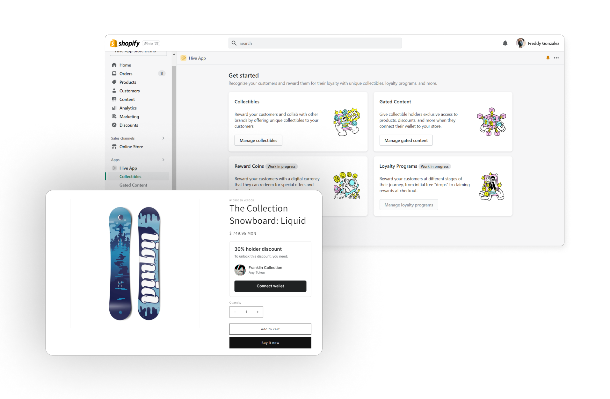

# Hive App

Hive App enables merchants to offer token gated experiences to customers, creating their own collections of tokens within the embedded app and adding exclusive discounts for token owners of a contract.

### Features

The following features are supported:

- [x] Collection minting: merchants can create and mint a new NFT collection inside the app so they don't have to go somewhere else for it.
- [x] Gated Content: merchants can offer a discount amount or percentage to owners of one or more collections, discounts are automatically applied if customer meets the requirements.
- [ ] Loyalty Programs: merchants can offer more than gated content, they can also offer customers post-purchase offers, like airdroping them an NFT after a purchase is made.
- [ ] Reward Coins: merchants can create their own token for their shop and use it as a rewarding system for customers, where they get an ammount of coins after each purchase; customers can later trade coins or redeem for promotions. Coins could also be accepted as a currency within the shop or other sites.
